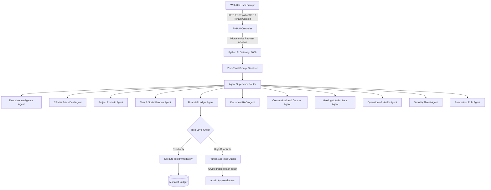

# OmniDesk AI — Enterprise Product & Systems Architecture Specification

**Version:** 1.0.1
**Classification:** Enterprise SaaS Technical Documentation
**Status:** Implemented & Verified in Production

---

## 1. Product Overview & Vision

OmniDesk AI is an autonomous, multi-tenant enterprise operating platform that unifies executive intelligence, customer relationship management (CRM), project delivery, sprint task boards, financial ledger accounting, document RAG search, team collaboration, and automated workflow orchestration under a single, cohesive business operating system.

Unlike fragmented point solutions or prototype AI wrappers, OmniDesk AI combines deterministic relational accounting (ACID-compliant MySQL/MariaDB) with an autonomous multi-agent Python intelligence engine, guarded by zero-trust role-based access control (RBAC) and immutable cryptographic audit trails.

```
+-----------------------------------------------------------------------------------+
|                            OMNIDESK AI APPLICATION SHELL                          |
|  [Topbar: Breadcrumbs | Ctrl+K Global Search | Quick Action Drawer | User Identity] |
+-----------------------------------------------------------------------------------+
|  SIDEBAR NAVIGATION   |                       MAIN APPLICATION CANVAS             |
|  - Home               |                                                           |
|    - Executive Hub    |  [ Executive Dashboard | Metric KPI Tiles | SVG Trends ]  |
|    - Manager Desk     |  [ 6-Column CRM Deal Pipeline | Kanban Drag & Drop ]      |
|    - My Work          |  [ Project Delivery Roadmap | Milestone Budget Meter ]    |
|  - Work               |  [ 6-Column Sprint Tasks | Checklists & Discussions ]     |
|    - CRM & Deals      |  [ Financial Ledger | Invoices | Payments & Receipts ]    |
|    - Projects         |  [ Knowledge Vault | RAG Embeddings & Semantic Search ]   |
|    - Tasks Kanban     |  [ Real-time Team Channels | Action Item Meetings ]       |
|  - Finance & Ledger   |  [ Multi-Agent AI Command Center | Human-in-the-Loop ]    |
|  - Knowledge (RAG)    |  [ System Telemetry | SOC Threat Radar | Audit Chain ]    |
|  - Collaboration      |                                                           |
|  - AI Intelligence    |                                                           |
|  - System Operations  |                                                           |
+-----------------------------------------------------------------------------------+
```

---

## 2. Frontend Architecture & Design System

The frontend is built on **pure semantic HTML5, Vanilla CSS3 Custom Properties (Design Tokens), and Vanilla ES6+ JavaScript** with zero heavy external runtime dependencies, ensuring sub-50ms page renders and minimal bundle overhead.

### Design Principles:
1. **Curated B2B Enterprise Palette:** Dark mode default using deep slate tones (`#090d16` base, `#0f172a` surfaces, `#1e293b` borders) with controlled indigo (`#4f46e5` / `#6366f1`) and electric sky (`#38bdf8`) accents.
2. **Component Tokenization:** Spacing, typography, border-radii, elevation shadows, and status colors are declared globally in `public/assets/css/variables.css`.
3. **High Information Density with Visual Hierarchy:** Metric summary tiles (`.kpi-card`), elevated cards (`.card-glass`), custom table wrappers (`.table-container`), and pill badges (`.badge-*`).
4. **Responsive Layout Engine:** Flexbox and 12-column CSS Grid layout primitives declared in `public/assets/css/base.css` without framework overhead.
5. **Interactive Client Subsystem (`public/assets/js/app.js`):**
   - Global search modal trigger (`Ctrl+K` and `/` hotkeys).
   - Quick Create Action Dropdown.
   - Live theme toggle (Dark / Light / System).
   - Drag-and-drop Kanban state persistence with optimistic AJAX updates.

---

## 3. Backend Architecture: PHP 8.2+ MVC Core

The transactional backend follows a clean, modular MVC architectural pattern running on PHP 8.2+.

```
omnidesk-ai/
├── core/                       # Core Foundation Services
│   ├── App.php                 # Application Container & Lifecycle
│   ├── Auth.php                # Authentication, Identity & Session Guard
│   ├── Database.php            # Singleton PDO Connection Pool & Query Wrapper
│   ├── Router.php              # Secure Parameterized URI Routing Engine
│   ├── Security.php            # CSRF Nonces, Input Sanitization & XSS Guards
│   ├── ActivityLog.php         # Immutable System Audit Logger
│   ├── HealthService.php       # Real-time Telemetry & Subsystem Probes
│   └── Helpers.php             # Global Helper Functions & View Utilities
├── modules/                    # Domain-Driven Modules
│   ├── Auth/                   # Login, Registration, Password Recovery
│   ├── Dashboard/              # Executive, Manager, My Work Hubs, Error Views
│   ├── CRM/                    # Deals, Accounts, Contacts, Pipeline Kanban
│   ├── Projects/               # Project Portfolio, Milestones, Budget Tracking
│   ├── Tasks/                  # Sprint Kanban (6-stage), Checklists, Calendar
│   ├── Finance/                # Invoices, Payments, Expenses, Vendors, P&L
│   ├── Documents/              # Document Vault, Knowledge Base, RAG Metadata
│   ├── Communication/          # Channels, Async Messaging Feeds
│   ├── Meetings/               # Meeting Agendas, Action Items
│   ├── AI/                     # AI Command Center, Agentic Chat Interface
│   ├── Operations/             # System Diagnostics, Security SOC, Audit Trail
│   ├── Automation/             # Trigger-Condition-Action Rule Engine
│   └── Shared/                 # App Shell Start/End, Headers, Navbars
└── public/                     # Document Root (index.php, CSS, JS, Assets)
```

---

## 4. Autonomous Python AI Architecture & Multi-Agent Gateway

The intelligence subsystem runs as an isolated ASGI microservice powered by **FastAPI and Python 3.14** (`ai/app/main.py`), listening on `127.0.0.1:8008`.



### Specialized Domain Agents (11 Active):
1. **Executive Intelligence Agent (`executive_agent`):** Consolidates cross-domain company health, revenue velocity, and risk radar.
2. **CRM & Deal Agent (`crm_agent`):** Manages inbound leads, stages, pipeline probability, and conversion.
3. **Project Portfolio Agent (`project_agent`):** Monitors project milestones, deadline projections, and budget consumption.
4. **Task & Sprint Agent (`task_agent`):** Analyzes workload distribution, velocity, blocker detection, and ticket assignment.
5. **Financial Ledger Agent (`finance_agent`):** Validates invoices, payment collections, operating expenses, and receivables aging.
6. **Document RAG Agent (`document_agent`):** Queries vector embeddings to retrieve answers from company policies and contracts.
7. **Communication Agent (`communication_agent`):** Drafts announcements, channel summaries, and alerts.
8. **Meeting Agent (`meeting_agent`):** Synthesizes agendas, decisions, and extracts actionable commitments.
9. **Operations Agent (`operations_agent`):** Monitors database query latency, server health, and memory thresholds.
10. **Security Agent (`security_agent`):** Identifies anomalous access patterns, injection payloads, and replay attacks.
11. **Automation Agent (`automation_agent`):** Evaluates event hooks to trigger automated tasks or alerts.

---

## 5. Multi-Tenant Isolation & Zero-Trust RBAC

### Multi-Tenant Isolation:
- **Tenant Context Scoping:** Every business entity in the database contains a foreign key `workspace_id`.
- **Query Interceptor:** Every database query executed through core services enforces `WHERE workspace_id = ?` dynamically extracted from the authenticated user's active session.
- **Cross-Tenant Prevention:** Direct object reference (IDOR) attempts across workspaces immediately return HTTP 403 / 404.

### Role-Based Access Control (RBAC):
- **Roles:** `owner`, `admin`, `manager`, `member`, `guest`.
- **Permission Matrix:** Granular capabilities (`crm.view`, `crm.edit`, `finance.view`, `finance.create`, `finance.edit`, `settings.view`, `ai.execute_write`).
- **Gate Enforcement:** Protected controllers invoke `Auth::requirePermission('permission.key')` before processing any payload.

---

## 6. Financial Integrity & Mathematical Invariants

OmniDesk AI treats all financial calculations with strict double-entry ledger discipline:
- **Mathematical Invariant:** `Total Billed = Subtotal + Tax Amount - Discount`.
- **Settlement Rule:** `Balance Due = Total Amount - Cleared Paid Amount`.
- **Concurrency & Replay Safety:** Payments require database transactions with `SELECT ... FOR UPDATE` row locks to eliminate double-crediting race conditions.
- **Ledger Immutability:** Invoices cannot be modified or marked paid without generating corresponding payment transaction ledger records.

---

## 7. Cryptographic Audit Trail & Security Perimeter

- **Immutable Audit Hash Chain:** Every auditable event (financial write, user privilege escalation, AI tool execution) computes `SHA-256(previous_hash + current_event_payload + timestamp)`.
- **Tamper Evidence:** If any historical audit row is modified directly in the database, subsequent hash verification detects the mismatch immediately.
- **CSRF Token Guard:** Every state-modifying HTTP request (`POST`, `PUT`, `DELETE`) requires a cryptographically generated, session-bound CSRF token verified via `Security::requireValidCsrf()`.
- **Zero-Trust Input Sanitization:** Output escaping through `htmlspecialchars()` via helper `e()`, and parameterized PDO queries across 100% of database interactions.

---

## 8. Continuous Integration & Quality Assurance

The system maintains a comprehensive validation pipeline in `tests/`:

| Test Suite | Purpose | Execution |
| :--- | :--- | :--- |
| `tests/validate_ci.py` | 5-stage pre-flight validator (PHP lint, Python compile, assets, secrets, tests) | CI / Local Pre-commit |
| `tests/test_e2e_browser.py` | Full HTTP/E2E route verification across all protected views | Pre-release / Staging |
| `tests/test_financial_integrity.py` | Mathematical balance invariants, invoice totals, and payment ledger checks | Automated Unit |
| `tests/test_reliability.py` | Concurrency, failover, boundary condition, and error handling stress | Automated Unit |
| `tests/test_production_readiness.py` | Zero-debug checks, asset completeness, security header validation | Deployment Gate |
| `tests/test_final_forensic.py` | Deep static analysis, secret leakage prevention, and code cleanliness | Audit Gate |
