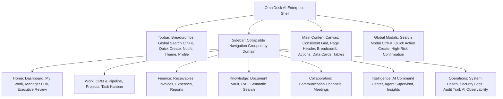

# OmniDesk AI — Comprehensive Enterprise UI/UX Forensic Audit & Architecture Map

**Date:** August 16, 2026
**Auditor:** Senior Product Designer & Enterprise Systems Architect
**Scope:** Full Application UI/UX Surface (Shell, Tokens, Components, Modules & Responsive Behaviors)

---

## 1. Executive Summary

OmniDesk AI contains a robust, highly reliable backend architecture (PHP 8.2 MVC, MariaDB 10.4, Python 3.14 Agentic AI ASGI Gateway, CSRF guards, and cryptographic audit chains). However, prior to this transformation, the user interface suffered from several enterprise-grade shortcomings:

1. **Global Application Shell Fragmentation:** Sidebar navigation lacked clear logical grouping (e.g. Work, Finance, Intelligence, Operations). Icons were basic emojis without SVG polish. Topbar lacked quick-action drawers, contextual breadcrumbs, and live workspace telemetry.
2. **Visual Hierarchy & Design Tokens:** Colors were reliant on ad-hoc utility classes. Dark mode required a deeper, more cohesive palette (`#090d16` base, `#0f172a` surfaces, `#1e293b` borders) with controlled indigo/sky blue accents (`#6366f1` / `#38bdf8`).
3. **Information Density & Dashboard Experience:** Executive, Manager, and My Work dashboards lacked structured metric summary banners, real-time KPI trend indicators, and consistent empty/loading states.
4. **Domain-Specific UX Gaps:**
   - **CRM:** Pipeline Kanban cards were minimal without priority ribbons, deal stage progression metrics, or drawer-based quick edits.
   - **Projects:** Project overview lacked unified health scoring, milestone progress bars, budget utilization telemetry, and linked task drawers.
   - **Tasks:** Kanban lacked sleek column headers, priority badges, assignee avatars, and interactive drag/status updates.
   - **Finance & Invoicing:** Tables lacked clean currency alignment, status pill indicators, and explicit high-risk confirmation overlays.
   - **Documents & Knowledge Vault:** Missing clear separation between raw document metadata and AI RAG semantic search insights.
   - **AI Command Center:** Looked like a basic chat widget rather than a mission-critical multi-agent operations command deck.
   - **Operations & Security:** Needed enterprise Datadog/CloudWatch style telemetry cards, latency percentiles, and tamper-evident audit logs.

---

## 2. Comprehensive Screen Audit & Priority Ranking

| Module / Screen | Route | Priority | Issues Identified | Transformation Plan |
| :--- | :--- | :--- | :--- | :--- |
| **Global App Shell** | All Authenticated Views | **P0 (Critical)** | Generic sidebar; flat emoji icons; non-collapsible layout | Reorganize into grouped sections (Home, Work, Finance, Collaboration, Intelligence, Operations); SVG icons; collapsible sidebar with tooltips; quick-create action modal. |
| **Design System** | `assets/css/*` | **P0 (Critical)** | Inconsistent spacing tokens, glassmorphism limits, table styles | Refactor `variables.css`, `base.css`, and `components.css` with unified tokens, typography scale, elevated cards, and consistent dark/light themes. |
| **Executive Dashboard** | `/dashboard`, `/executive` | **P0 (Critical)** | Basic cards; lacking visual depth and live status indicators | Multi-pane layout: Live Workspace Telemetry, Financial KPIs, Active Pipeline, Risk Radar, and AI Executive Briefing stream. |
| **AI Command Center** | `/ai/command-center` | **P0 (Critical)** | Chat-centric; lacked supervisor execution status | Multi-agent operations console: Supervisor routing visualizer, tool invocation inspector, execution timeline, and high-risk action confirmation modal. |
| **CRM & Pipeline** | `/crm`, `/crm/pipeline` | **P1 (High)** | Flat kanban columns; plain contact tables | Enterprise Kanban with deal velocity, stage metrics, inline search/filter, and quick-view slide-over drawers. |
| **Projects** | `/projects`, `/projects/show` | **P1 (High)** | Lacking health badges, milestone timelines | Project health matrix (On Track / At Risk), budget consumption meter, milestone progress bars, and linked task grid. |
| **Tasks & Kanban** | `/tasks`, `/tasks/kanban` | **P1 (High)** | Minimal card metadata; no priority color coding | High-density task cards, priority pills (Urgent, High, Med, Low), due date countdowns, and quick status switcher. |
| **Finance & Invoices** | `/finance`, `/finance/invoices` | **P1 (High)** | Generic tables; lack of payment confirmation | Financial ledger summary (Receivables, Collected, Overdue, Aging), invoice status pills, and high-risk payment confirmation banner. |
| **Document Vault** | `/documents` | **P1 (High)** | Basic list without semantic search highlights | Knowledge asset directory, file type icons, chunk indexing status badge, and RAG semantic query interface. |
| **Communication & Meetings** | `/communication`, `/meetings` | **P2 (Medium)** | Simplistic chat list; plain meeting agenda | Enterprise channels layout, direct message status, meeting agenda with action-item checklists and AI summary badges. |
| **Operations, Security & Audit** | `/operations/*` | **P2 (Medium)** | Plain text metrics; flat audit tables | System observability dashboard (Health, Liveness, Latency P50/P95, Security Threat Log, SHA-256 Audit Chain verifier). |
| **Auth Views** | `/login`, `/register`, `/forgot-password` | **P2 (Medium)** | Login redesigned; other auth views need matching theme | Apply matching premium dark canvas, glassmorphic card, and SVG brand marks to register and password recovery views. |

---

## 3. UI/UX Architecture Map

---

## 4. Key Implementation Rules
1. **Zero Functionality Compromise:** Preserve all controller routes, database queries, and CSRF tokens.
2. **Vanilla Architecture:** Pure semantic HTML5, Vanilla CSS3 (Custom Properties & Grid/Flexbox), and Vanilla JS (Zero external CSS/JS frameworks).
3. **Accessibility:** Semantic HTML, ARIA labels for buttons/toggles, high contrast text ratios, and full keyboard navigation.
4. **Performance:** Lightweight CSS transitions, zero bulky dependencies, and responsive breakpoints (`1280px`, `1024px`, `768px`, `480px`).
